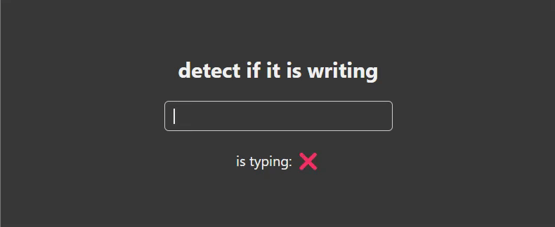

# React useTyping


This is a very simple hook, which detects if the user is still typing, this hook receives 2 parameters, the text, and the time between one keystroke and another.



its use is as simple as this

```js
const isTyping = useTyping(text)
const isTyping = useTyping(text, 1000)
```

## code

you can copy and paste this code into a new hook in your project, as simple as that!

```js
import { useState, useRef, useEffect } from 'react'

export default function useTyping(text, timeout = 400) {
  let [isTyping, setIsTyping] = useState(false)
  let timeoutRef = useRef(null)

  const endTyping = () => {
    setIsTyping(false)
    clearTimeout(timeoutRef.current)
  }

  useEffect(() => {
    if (isTyping) {
      clearTimeout(timeoutRef.current)
      timeoutRef.current = setTimeout(endTyping, timeout)
    } else {
      setIsTyping(true)
      timeoutRef.current = setTimeout(endTyping, timeout)
    }

    return () => clearTimeout(timeoutRef.current)
  }, [text])

  return isTyping
}
```
